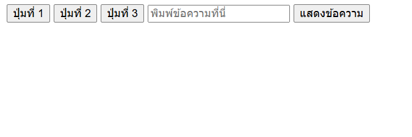
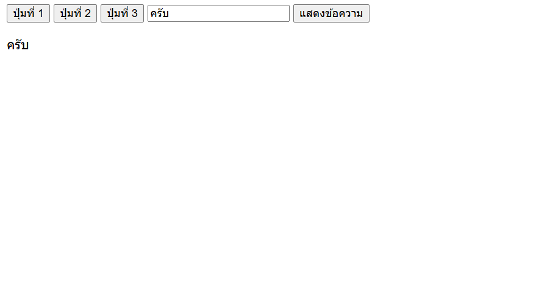
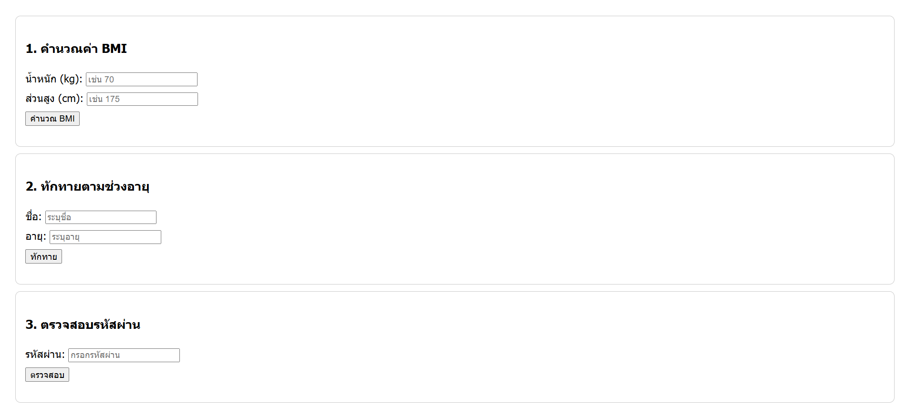
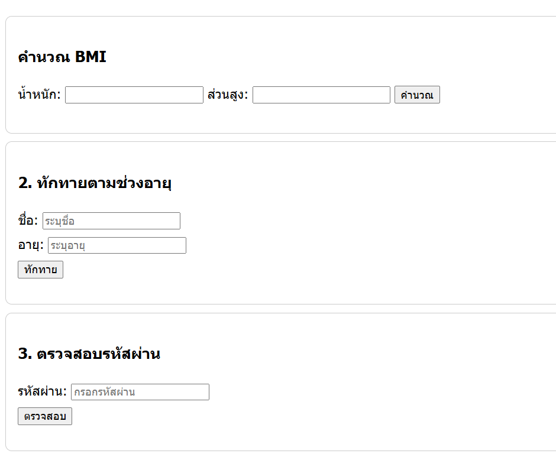
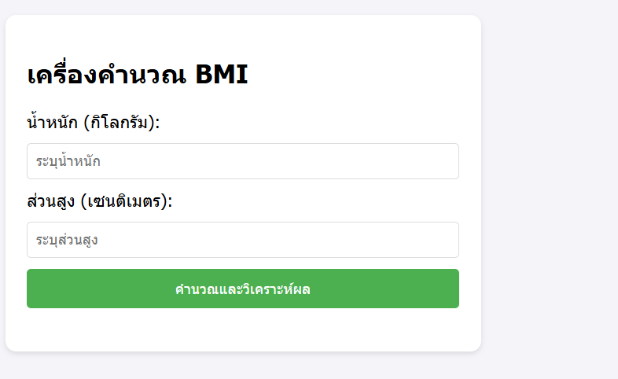

# การทดลอง พื้นฐาน JavaScript และการใช้งานร่วมกับ HTML/CSS
## การทดลองที่ 1 : ทำความรู้จักกับ JavaScript
###  การเพิ่ม JavaScript ลงในเว็บเพจ

JavaScript สามารถเพิ่มลงในเว็บเพจได้ 3 วิธี:

1. แบบ Inline: แทรก scipt ในแต่ละบรรทัดของ HTML Element
```html
<button onclick="alert('สวัสดี!')">คลิกที่นี่</button>
```

2. แบบ Internal Script: เขียน script ใน block   <script> </script>
```html
<script>
    alert('สวัสดี!');
</script>
```

3. แบบ External Script: เขียน script ในไฟล์แล้วเรียกใช้ใน HTML
   ไฟล์ script.js มีข้อมูลดังนี้
```javascript
    alert('สวัสดี!');
```
   ไฟล์ HTML มีการเรียกใช้ script ดังนี้
```html
<script src="script.js"></script>
```

### การทดลองที่ 1.1 : สร้างไฟล์ HTML และทดลองใช้ JavaScript ทั้ง 3 แบบ

สร้างไฟล์ `index.html`:
```html
<!DOCTYPE html>
<html lang="th">
<head>
    <meta charset="UTF-8">
    <title>ทดลอง JavaScript</title>
</head>
<body>
    <!-- Inline JavaScript -->
    <button onclick="alert('คลิกปุ่มที่ 1!')">ปุ่มที่ 1</button>

    <!-- ทดสอบ Internal JavaScript -->
    <button id="btn2">ปุ่มที่ 2</button>

    <!-- ทดสอบ External JavaScript -->
    <button id="btn3" onclick="hello3();">ปุ่มที่ 3</button>

    <!-- Internal JavaScript -->
    <script>
        document.getElementById('btn2').onclick = function() {
            alert('คลิกปุ่มที่ 2!');
        };
    </script>

    <!-- External JavaScript -->
  <!-- ต้องสร้างไฟล์ script.js มีโค้ดโปรแกรมในไฟล์ดังนี้
   function hello3(){
    alert('คลิกปุ่มที่ 3!');
    }
 -->
    <script src="script.js"></script>
</body>
</html>
```

### แบบฝึกปฏิบัติที่ 1: การใช้งาน JavaScript เบื้องต้น

1. สร้างหน้าเว็บที่มีปุ่ม 3 ปุ่ม:
   - ปุ่มที่ 1: ใช้ Inline JavaScript แสดงชื่อนักศึกษา
   - ปุ่มที่ 2: ใช้ Internal JavaScript แสดงวันที่ปัจจุบัน
   - ปุ่มที่ 3: ใช้ External JavaScript แสดงเวลาปัจจุบัน

2. เพิ่มกล่องข้อความและปุ่มสำหรับแสดงผล:
   - มีช่องกรอกข้อความ
   - มีปุ่มเมื่อคลิกแล้วจะแสดงข้อความที่กรอกในช่องข้อความ  (สามารถใช้ document.getElementById('id ของ textbox').value เพื่อดึงข้อมูลในช่อง)
### บันทึกผลการทดลอง 
```html
<!DOCTYPE html>
<html lang="th">
<head>
    <meta charset="UTF-8">
    <title>ทดลอง JavaScript</title>
</head>
<body>
    <!-- Inline JavaScript -->
    <button onclick="alert('คลิกปุ่มที่ 1!')">ปุ่มที่ 1</button>

    <!-- ทดสอบ Internal JavaScript -->
    <button id="btn2">ปุ่มที่ 2</button>

    <!-- ทดสอบ External JavaScript -->
    <button id="btn3" onclick="hello3();">ปุ่มที่ 3</button>

    <!-- Internal JavaScript -->
    <script>
        document.getElementById('btn2').onclick = function() {
            alert('คลิกปุ่มที่ 2!');
        };
    </script>

    <!-- External JavaScript -->
  <!-- ต้องสร้างไฟล์ script.js มีโค้ดโปรแกรมในไฟล์ดังนี้
   function hello3(){
    alert('คลิกปุ่มที่ 3!');
    }
 -->
    <script src="script.js"></script>
</body>
</html>
```
**รูปผลการทดลอง**


## การทดลองที่ 2: พื้นฐาน JavaScript
### 2.1 การประกาศตัวแปรและชนิดข้อมูล

JavaScript มีวิธีการประกาศตัวแปร 3 แบบ:
- `var`: ประกาศตัวแปรแบบเดิม (legacy) - ไม่แนะนำให้ใช้ในโค้ดสมัยใหม่
- `let`: ประกาศตัวแปรที่สามารถเปลี่ยนแปลงค่าได้ - เหมาะสำหรับค่าที่ต้องการเปลี่ยนแปลงในภายหลัง
- `const`: ประกาศตัวแปรที่ไม่สามารถเปลี่ยนแปลงค่าได้ - เหมาะสำหรับค่าคงที่

ชนิดข้อมูลพื้นฐานใน JavaScript:
1. Number: ตัวเลขทั้งจำนวนเต็มและทศนิยม
2. String: ข้อความ ใช้เครื่องหมาย '' หรือ ""
3. Boolean: ค่าความจริง true/false
4. Undefined: ตัวแปรที่ยังไม่ได้กำหนดค่า
5. Null: ตัวแปรที่ไม่มีค่า (ต่างจาก undefined)
6. Array
7. Object
   
### ตัวอย่าง การประกาศตัวแปรแต่ละแบบ
```javascript
// ประกาศตัวแปรแบบ let - สามารถเปลี่ยนแปลงค่าได้ในภายหลัง
let name = "สมชาย";     // String เก็บข้อความ
let age = 25;           // Number เก็บตัวเลข
let isStudent = true;   // Boolean เก็บค่าจริง/เท็จ

// ประกาศตัวแปรแบบ const - ไม่สามารถเปลี่ยนแปลงค่าได้หลังจากประกาศ
const PI = 3.14;            // ค่าคงที่ทางคณิตศาสตร์
const DAYS_IN_WEEK = 7;     // ค่าคงที่ที่ไม่ควรเปลี่ยนแปลง

// การเปลี่ยนแปลงค่าตัวแปร
name = "สมหญิง";   // ทำได้เพราะประกาศด้วย let
age = 26;          // สามารถเปลี่ยนค่าได้
// PI = 3.15;      // Error! ไม่สามารถเปลี่ยนค่า const ได้

// ตัวอย่างการใช้งาน undefined และ null
let uninitializedVar;           // มีค่าเป็น undefined โดยอัตโนมัติ
let emptyValue = null;          // กำหนดค่า null อย่างชัดเจน

// ตัวอย่างการประกาศ Array
let fruits = ["แอปเปิ้ล", "กล้วย", "ส้ม"];

// ตัวอย่างการประกาศ Object
let person = {
    name: "สมชาย",
    age: 25,
    isStudent: true
};
```

### 📝 แบบทดสอบที่ 2.1: การทดลองประกาศตัวแปร
1. สร้างตัวแปรเก็บข้อมูล รหัสนักศึกษา ชื่อนักศึกษา คะแนนสอบกลางภาค, คะแนนสอบปลายภาค โดยเลือกใช้ let หรือ const 
2. สร้าง Object สำหรับเก็บข้อมูลนักศึกษา  ประกอบด้วยข้อมูล รหัสนักศึกษา, ชื่อ, สาขาวิชา, เกรดเฉลี่ย

### บันทึกผลการทดลอง 2.1
```html
<!DOCTYPE html>
<html lang="th">
<head>
    <meta charset="UTF-8">
    <title>ทดลอง JavaScript</title>
</head>
<body>
    <!-- Inline JavaScript -->
    <button onclick="alert('คลิกปุ่มที่ 1!')">ปุ่มที่ 1</button>

    <!-- ทดสอบ Internal JavaScript -->
    <button id="btn2">ปุ่มที่ 2</button>

    <!-- ทดสอบ External JavaScript -->
    <button id="btn3" onclick="hello3();">ปุ่มที่ 3</button>

    <!-- Internal JavaScript -->
    <script>
        document.getElementById('btn2').onclick = function() {
            alert('คลิกปุ่มที่ 2!');
        };
    </script>
    <script src="script.js"></script>
</body>
</html>
```
**รูปผลการทดลอง**



### 2.2 การดำเนินการทางคณิตศาสตร์

JavaScript มีตัวดำเนินการทางคณิตศาสตร์พื้นฐานดังนี้:
- `+` การบวก
- `-` การลบ
- `*` การคูณ
- `/` การหาร
- `%` การหารเอาเศษ (modulo)
- `**` การยกกำลัง (exponentiation)
- `++` การเพิ่มค่าทีละ 1 (increment)
- `--` การลดค่าทีละ 1 (decrement)

### แบบฝึกหัด 2.2: ทดลองใช้ตัวดำเนินการทางคณิตศาสตร์
```javascript
// กำหนดค่าตัวแปรเริ่มต้น
let x = 10;
let y = 5;

// การดำเนินการพื้นฐาน
let sum = x + y;      // บวก: 10 + 5 = 15
let diff = x - y;     // ลบ: 10 - 5 = 5
let product = x * y;  // คูณ: 10 * 5 = 50
let quotient = x / y; // หาร: 10 / 5 = 2
let remainder = x % y; // หารเอาเศษ: 10 % 5 = 0 (หาร 5 ลงตัว)

// การเพิ่ม/ลดค่าทีละ 1
let counter = 1;
counter++;            // เพิ่มค่าทีละ 1: counter = 2
counter--;            // ลดค่าทีละ 1: counter = 1

// การยกกำลัง
let squared = x ** 2;  // 10 ยกกำลัง 2 = 100
let cubed = x ** 3;    // 10 ยกกำลัง 3 = 1000

// การใช้ตัวดำเนินการร่วมกับการกำหนดค่า
let number = 5;
number += 3;          // เท่ากับ number = number + 3
number -= 2;          // เท่ากับ number = number - 2
number *= 4;          // เท่ากับ number = number * 4
number /= 2;          // เท่ากับ number = number / 2

```

### 📝 แบบทดสอบที่ 2.2: การคำนวณพื้นฐาน
1. เขียนโปรแกรม กำหนดคะแนน  3 วิชา แล้วหาค่าคะแนนเฉลี่ย แล้วแสดงผลการคำนวณ
```javascript
// คะแนน 3 วิชา
let subject1 = 85;
let subject2 = 90;
let subject3 = 78;

// คำนวณคะแนนเฉลี่ย
let average = (subject1 + subject2 + subject3) / 3;

// แสดงผล
console.log("คะแนนเฉลี่ย:", average.toFixed(2));
```

2. เขียนโปรแกรม กำหนดชื่อสินค้า ราคาสินค้า คำนวณราคาสินค้าที่รวม VAT 7% แล้วแสดงผลการคำนวณ
```javascript
// ข้อมูลสินค้า
let productName = "สมุดโน้ต";
let productPrice = 100; // ราคาสินค้า
const VAT_RATE = 0.07; // อัตรา VAT 7%

// คำนวณราคาสินค้ารวม VAT
let totalPrice = productPrice + (productPrice * VAT_RATE);

// แสดงผล
console.log("สินค้า:", productName);
console.log("ราคาสินค้ารวม VAT:", totalPrice.toFixed(2));
```

### บันทึกผลการทดลอง 2.2
```html
<!DOCTYPE html>
<html lang="th">
<head>
    <meta charset="UTF-8">
    <title>ทดลอง JavaScript</title>
</head>
<body>
    <!-- Inline JavaScript -->
    <button onclick="alert('คลิกปุ่มที่ 1!')">ปุ่มที่ 1</button>

    <!-- ทดสอบ Internal JavaScript -->
    <button id="btn2">ปุ่มที่ 2</button>

    <!-- ทดสอบ External JavaScript -->
    <button id="btn3" onclick="hello3();">ปุ่มที่ 3</button>

    <!-- Internal JavaScript -->
    <script>
        document.getElementById('btn2').onclick = function() {
            alert('คลิกปุ่มที่ 2!');
        };
    </script>
    <script src="script.js"></script>
</body>
</html>
```
**รูปผลการทดลอง**


### 2.3 การควบคุมการทำงาน

JavaScript มีโครงสร้างควบคุมการทำงานหลักๆ ดังนี้:

1. เงื่อนไข (Conditionals):
   - `if`: ตรวจสอบเงื่อนไขเดียว
   - `if...else`: ตรวจสอบเงื่อนไขและมีทางเลือก
   - `if...else if...else`: ตรวจสอบหลายเงื่อนไข
   - `switch`: เลือกทำงานตามค่าที่กำหนด

2. การวนซ้ำ (Loops):
   - `for`: วนซ้ำตามจำนวนรอบที่กำหนด
   - `while`: วนซ้ำตราบใดที่เงื่อนไขเป็นจริง
   - `do...while`: ทำงานอย่างน้อย 1 ครั้ง แล้ววนซ้ำตามเงื่อนไข
   - `for...of`: วนซ้ำสำหรับข้อมูลแบบ iterable
   - `for...in`: วนซ้ำสำหรับ properties ใน object


```javascript
// 1. การใช้ if-else
let score = 75;

// ตรวจสอบเงื่อนไขตามลำดับ
if (score >= 80) {         // ถ้าคะแนน >= 80
    console.log("เกรด A");
} else if (score >= 70) {  // ถ้าคะแนน >= 70 แต่ < 80
    console.log("เกรด B");
} else {                   // ถ้าไม่ตรงเงื่อนไขใดเลย
    console.log("เกรด C");
}

// 2. การใช้ switch
let day = 1;
switch (day) {
    case 1:
        console.log("วันจันทร์");
        break;              // break เพื่อออกจาก switch
    case 2:
        console.log("วันอังคาร");
        break;
    default:               // ค่าเริ่มต้นถ้าไม่ตรงกับ case ใดๆ
        console.log("วันอื่นๆ");
}

// 3. การใช้ for loop
// วนซ้ำ 5 รอบ: เริ่มที่ 1, ทำจนถึง 5, เพิ่มค่าทีละ 1
for (let i = 1; i <= 5; i++) {
    console.log("รอบที่", i);
}

// 4. การใช้ while loop
// วนซ้ำตราบใดที่เงื่อนไขเป็นจริง
let count = 1;
while (count <= 3) {      // ทำซ้ำตราบใดที่ count <= 3
    console.log("นับ:", count);
    count++;              // เพิ่มค่า count ทีละ 1
}

// 5. การใช้ do...while loop
// ทำงานอย่างน้อย 1 ครั้ง แล้วค่อยตรวจสอบเงื่อนไข
let num = 1;
do {
    console.log("ตัวเลข:", num);
    num++;
} while (num <= 3);

// 6. การใช้ for...of loop กับ array
let fruits = ['แอปเปิ้ล', 'กล้วย', 'ส้ม'];
for (let fruit of fruits) {
    console.log("ผลไม้:", fruit);
}

// 7. การใช้ for...in loop กับ object
let person = {
    name: 'สมชาย',
    age: 25,
    job: 'โปรแกรมเมอร์'
};
for (let key in person) {
    console.log(key + ":", person[key]);
}

// 8. การใช้เงื่อนไขซ้อน (Nested Conditions)
let age = 18;
let hasPermission = true;

if (age >= 18) {
    if (hasPermission) {
        console.log("สามารถเข้าใช้งานได้");
    } else {
        console.log("ต้องได้รับอนุญาตก่อน");
    }
} else {
    console.log("อายุไม่ถึงเกณฑ์");
}

// 9. การใช้ตัวดำเนินการลอจิคัล (Logical Operators)
let isStudent = true;
let isMember = false;

if (isStudent && isMember) {           // AND (&&)
    console.log("เป็นทั้งนักเรียนและสมาชิก");
} else if (isStudent || isMember) {    // OR (||)
    console.log("เป็นอย่างใดอย่างหนึ่ง");
} else {
    console.log("ไม่เป็นทั้งสองอย่าง");
}

// 10. การใช้ break และ continue
for (let i = 1; i <= 5; i++) {
    if (i === 3) {
        continue;    // ข้ามการทำงานที่เหลือในรอบนี้
    }
    if (i === 4) {
        break;       // ออกจาก loop ทันที
    }
    console.log("ตัวเลข:", i);
}
```


### 📝 แบบทดสอบที่ 2.3: การควบคุมการทำงาน
1. กำหนดตัวเลข และตรวจสอบว่าตัวเลขที่กำหนดเป็นเลขคู่หรือเลขคี่
```javascript
let number = 7;
if (number % 2 === 0) {
    console.log(`${number} เป็นเลขคู่`);
} else {
    console.log(`${number} เป็นเลขคี่`);
}
```

2. สร้าง loop แบบ for แสดงตารางสูตรคูณ แม่ 2 และ loop แบบ while แสดงสูตรคูณ แม่ 3
```javascript
// ตารางสูตรคูณ แม่ 2
for (let i = 1; i <= 12; i++) {
    console.log(`2 x ${i} = ${2 * i}`);
}

// ตารางสูตรคูณ แม่ 3
let j = 1;
while (j <= 12) {
    console.log(`3 x ${j} = ${3 * j}`);
    j++;
}
```

3. เขียนโปรแกรมนับถอยหลังจาก 10 ถึง 1
```javascript
for (let i = 10; i >= 1; i--) {
    console.log(i);
}
```

4. เขียนโปรแกรมกำหนดอายุ และตรวจสอบช่วงวัยตามอายุที่กำหนด (กำหนดอายุแต่ละช่วงวัย วัยเด็ก วัยรุ่น วัยผู้ใหญ่)
```javascript
let age = 25;
if (age <= 12) {
    console.log("วัยเด็ก");
} else if (age <= 19) {
    console.log("วัยรุ่น");
} else {
    console.log("วัยผู้ใหญ่");
}
```

### บันทึกผลการทดลอง 2.3
```html
[บันทึกโค้ด ที่นี่]
```
**รูปผลการทดลอง**


### 2.4 Functions และ Arrow Functions

Functions คือกลุ่มคำสั่งที่สามารถนำมาใช้ซ้ำได้ ใน JavaScript มีวิธีการเขียน function 2 แบบหลักๆ:

1. Function แบบปกติ (Regular Functions):
   - ใช้คำสั่ง `function` ในการประกาศ
   - สามารถมีหรือไม่มีพารามิเตอร์ก็ได้
   - สามารถ return ค่ากลับหรือไม่ก็ได้
   - มี `this` context ของตัวเอง

2. Arrow Functions:
   - เป็นวิธีเขียนแบบสั้นที่มาใน ES6
   - ไม่มี `this` context ของตัวเอง
   - เหมาะสำหรับ function สั้นๆ
   - มักใช้ใน callback functions

#### ตัวอย่างการสร้างและเรียกใช้ Function 

```javascript
// 1. Function พื้นฐาน - ไม่มีพารามิเตอร์และไม่ return ค่า
function sayHello() {
    console.log("สวัสดี!");
}
sayHello();  // เรียกใช้ function: แสดง "สวัสดี!"

// 2. Function ที่รับพารามิเตอร์
function greet(name) {
    console.log("สวัสดี " + name);
}
greet("สมชาย");  // แสดง: "สวัสดี สมชาย"

// 3. Function ที่ return ค่า
function add(a, b) {
    return a + b;  // ส่งค่าผลบวกกลับ
}
let sum = add(5, 3);  // sum = 8

// 4. Function ที่มีค่าเริ่มต้นของพารามิเตอร์
function greetWithTitle(name, title = "คุณ") {
    console.log("สวัสดี " + title + " " + name);
}
greetWithTitle("สมชาย");          // แสดง: "สวัสดี คุณ สมชาย"
greetWithTitle("สมชาย", "ดร.");   // แสดง: "สวัสดี ดร. สมชาย"

// 5. Function ที่รับหลายพารามิเตอร์ (Rest Parameters)
function sum(...numbers) {
    let total = 0;
    for (let num of numbers) {
        total += num;
    }
    return total;
}
console.log(sum(1, 2, 3, 4));  // แสดง: 10

// 6. Function ที่ return หลายค่าโดยใช้ Object
function getPersonInfo() {
    return {
        name: "สมชาย",
        age: 25,
        job: "โปรแกรมเมอร์"
    };
}
let person = getPersonInfo();
console.log(person.name);  // แสดง: "สมชาย"

// 7. Function ที่เป็น Method ใน Object
let calculator = {
    add: function(a, b) {
        return a + b;
    },
    subtract: function(a, b) {
        return a - b;
    }
};
console.log(calculator.add(5, 3));      // แสดง: 8
console.log(calculator.subtract(5, 3));  // แสดง: 2

// 8. Nested Function (Function ซ้อน Function)
function outer(x) {
    function inner(y) {
        return x + y;  // inner function สามารถเข้าถึงตัวแปรของ outer function
    }
    return inner;
}
let addFive = outer(5);
console.log(addFive(3));  // แสดง: 8

// 9. Callback Function
function process(callback) {
    console.log("กำลังประมวลผล...");
    callback();  // เรียกใช้ function ที่ส่งเข้ามา
}
process(function() {
    console.log("เสร็จสิ้น!");
});

// 10. Immediately Invoked Function Expression (IIFE)
(function() {
    console.log("Function นี้ทำงานทันทีที่ถูกประกาศ");
})();
```


### 📝 แบบทดสอบที่ 2.4.1: Functions
1. สร้าง function คำนวณค่า BMI (ดัชนีมวลกาย) จากน้ำหนักและส่วนสูง
2. สร้าง function ที่รับชื่อและอายุ แล้วแสดงข้อความทักทายที่เหมาะสมกับอายุ
3. เขียน function ตรวจสอบรหัสผ่านว่ามีความยาวมากกว่า 8 ตัวอักษรหรือไม่

### บันทึกผลการทดลอง 2.4.1
```html
<!DOCTYPE html>
<html lang="th">
<head>
    <meta charset="UTF-8">
    <title>ทดสอบ Functions - Lab 2.4.1</title>
    <style>
        body { font-family: sans-serif; padding: 20px; line-height: 1.6; }
        .box { border: 1px solid #ccc; padding: 15px; margin-bottom: 10px; border-radius: 8px; }
        input { margin-bottom: 5px; }
    </style>
</head>
<body>

    <div class="box">
        <h3>1. คำนวณค่า BMI</h3>
        น้ำหนัก (kg): <input type="number" id="weight" placeholder="เช่น 70"><br>
        ส่วนสูง (cm): <input type="number" id="height" placeholder="เช่น 175"><br>
        <button onclick="runBMI()">คำนวณ BMI</button>
        <p id="resBMI"></p>
    </div>

    <div class="box">
        <h3>2. ทักทายตามช่วงอายุ</h3>
        ชื่อ: <input type="text" id="userName" placeholder="ระบุชื่อ"><br>
        อายุ: <input type="number" id="userAge" placeholder="ระบุอายุ"><br>
        <button onclick="runGreeting()">ทักทาย</button>
        <p id="resGreet"></p>
    </div>

    <div class="box">
        <h3>3. ตรวจสอบรหัสผ่าน</h3>
        รหัสผ่าน: <input type="password" id="passInput" placeholder="กรอกรหัสผ่าน"><br>
        <button onclick="runCheckPass()">ตรวจสอบ</button>
        <p id="resPass"></p>
    </div>

    <script src="script.js"></script>
</body>
</html>
```
**รูปผลการทดลอง**



#### 2.4.2 Arrow Function
Arrow Function เป็นวิธีการเขียน function แบบสั้นๆ ที่มาพร้อมกับ JavaScript เวอร์ชัน ES6

### ตัวอย่างการใช้ Arrow Function
```javascript
// Arrow Function แบบพื้นฐาน
const greet = (name) => {
    return "สวัสดี " + name;
};

// Arrow Function แบบย่อ (ถ้ามีคำสั่งเดียว)
const greetShort = name => "สวัสดี " + name;

// Arrow Function ที่มีหลายพารามิเตอร์
const multiply = (a, b) => a * b;

// Arrow Function ที่ไม่มีพารามิเตอร์
const getRandomNumber = () => Math.random();

// ตัวอย่างการใช้ Arrow Function กับ Array
const numbers = [1, 2, 3, 4, 5];

// การใช้ map กับ Arrow Function
const doubled = numbers.map(num => num * 2);
console.log("เลขคูณ 2:", doubled); // [2, 4, 6, 8, 10]

// การใช้ filter กับ Arrow Function
const evenNumbers = numbers.filter(num => num % 2 === 0);
console.log("เลขคู่:", evenNumbers); // [2, 4]
```
### แบบทดสอบ 2.4.2 เขียนฟังก์ชันต่อไปนี้ในรูปแบบ Arrow function
1. สร้าง function คำนวณค่า BMI (ดัชนีมวลกาย) จากน้ำหนักและส่วนสูง
2. สร้าง function ที่รับชื่อและอายุ แล้วแสดงข้อความทักทายที่เหมาะสมกับอายุ
3. เขียน function ตรวจสอบรหัสผ่านว่ามีความยาวมากกว่า 8 ตัวอักษรหรือไม่

### บันทึกผลการทดลอง 2.4.2
```html
<!DOCTYPE html>
<html lang="th">
<head>
    <meta charset="UTF-8">
    <title>ทดสอบ Functions - Lab 2.4.1</title>
    <style>
        body { font-family: sans-serif; padding: 20px; line-height: 1.6; }
        .box { border: 1px solid #ccc; padding: 15px; margin-bottom: 10px; border-radius: 8px; }
        input { margin-bottom: 5px; }
    </style>
</head>
<body>

    <div class="box">
        <h3>คำนวณ BMI</h3>
        น้ำหนัก: <input type="number" id="weight"> 
        ส่วนสูง: <input type="number" id="height">
        <button onclick="runBMI()">คำนวณ</button>
        <p id="resBMI"></p>
    </div>

    <div class="box">
        <h3>2. ทักทายตามช่วงอายุ</h3>
        ชื่อ: <input type="text" id="userName" placeholder="ระบุชื่อ"><br>
        อายุ: <input type="number" id="userAge" placeholder="ระบุอายุ"><br>
        <button onclick="runGreeting()">ทักทาย</button>
        <p id="resGreet"></p>
    </div>

    <div class="box">
        <h3>3. ตรวจสอบรหัสผ่าน</h3>
        รหัสผ่าน: <input type="password" id="passInput" placeholder="กรอกรหัสผ่าน"><br>
        <button onclick="runCheckPass()">ตรวจสอบ</button>
        <p id="resPass"></p>
    </div>

    <script src="script.js"></script>
</body>
</html>
```
**รูปผลการทดลอง**



## การทดลองที่ 3 : การใช้ JavaScript กับ HTML และ CSS
### การทดลองที่ 3.1 การสร้างปุ่มและจัดการ Event ด้วย JavaScript
### ตัวอย่างที่ 1 
```html
<!DOCTYPE html>
<html>
<head>
    <title>Event Handling</title>
</head>
<body>
    <button onclick="showMessage()">คลิกที่นี่</button>
    
    <script>
    function showMessage() {
        alert("สวัสดีครับ/ค่ะ!");
    }
    </script>
</body>
</html>
```
### ตัวอย่างที่ 2
```html
<!DOCTYPE html>
<html>
<head>
    <title>Event Handling</title>
</head>
<body>
    Enter name<input type="text" id="name">
    <button onclick="showMessage(document.getElementById('name').value)">คลิกที่นี่</button>
    
    <script>
    function showMessage(name) {
        alert("สวัสดีครับ/ค่ะ คุณ :",name);
    }
    </script>
</body>
</html>
```
### ตัวอย่างที่ 3 
```html
<!DOCTYPE html>
<html>
<head>
    <title>Event Handling</title>
</head>
<body>
    Enter name<input type="text" id="name">
    <p id="output_value"></p>
    <button onclick="showMessage(document.getElementById('name').value)">คลิกที่นี่</button>
    
    <script>
    function showMessage(name) {
        document.getElementById('output_value').innerHTML='Hello' + name;
    }
    </script>
</body>
</html>
```

### แบบทดสอบ 3.1 
1. เขียนเว็บ รับค่าน้ำหนักและส่วนสูง ทำการ คำนวณค่า BMI (ดัชนีมวลกาย) แล้วแสดงผลว่า อ้วน, ผอม หรือ สมส่วน โดยเขียนฟังก์ชันแบบ Arrow function

### บันทึกผลการทดลอง 3.1
```html
<!DOCTYPE html>
<html lang="th">
<head>
    <meta charset="UTF-8">
    <title>โปรแกรมคำนวณ BMI</title>
    <style>
        body { font-family: 'Tahoma', sans-serif; padding: 20px; background-color: #f4f4f9; }
        .container { background: white; padding: 20px; border-radius: 10px; box-shadow: 0 2px 5px rgba(0,0,0,0.1); max-width: 400px; }
        input { width: 100%; padding: 8px; margin: 10px 0; border: 1px solid #ddd; border-radius: 4px; box-sizing: border-box; }
        button { background-color: #4CAF50; color: white; padding: 10px 15px; border: none; border-radius: 4px; cursor: pointer; width: 100%; }
        button:hover { background-color: #45a049; }
        #result { margin-top: 20px; font-weight: bold; font-size: 1.2em; text-align: center; color: #333; }
    </style>
</head>
<body>

    <div class="container">
        <h2>เครื่องคำนวณ BMI</h2>
        น้ำหนัก (กิโลกรัม): <input type="number" id="weight" placeholder="ระบุน้ำหนัก">
        ส่วนสูง (เซนติเมตร): <input type="number" id="height" placeholder="ระบุส่วนสูง">
        
        <button onclick="processBMI()">คำนวณและวิเคราะห์ผล</button>
        
        <div id="result"></div>
    </div>

    <script>
        // 1. Arrow Function สำหรับคำนวณและวิเคราะห์ผล
        const checkBMI = (w, h) => {
            if (!w || !h) return "กรุณากรอกข้อมูลให้ครบถ้วน";
            
            const heightM = h / 100;
            const bmi = (w / (heightM * heightM)).toFixed(2);
            let status = "";

            // ตรรกะการตัดสินใจ (Conditionals)
            if (bmi < 18.5) {
                status = "ผอม (น้ำหนักน้อยกว่าเกณฑ์)";
            } else if (bmi >= 18.5 && bmi <= 22.9) {
                status = "สมส่วน (สุขภาพดี)";
            } else if (bmi >= 23.0 && bmi <= 24.9) {
                status = "น้ำหนักเกิน (ท้วม)";
            } else {
                status = "อ้วน";
            }

            return `ค่า BMI ของคุณคือ: ${bmi} <br> ผลวิเคราะห์: ${status}`;
        };

        // 2. Function สำหรับเชื่อมต่อกับหน้าเว็บ (Event Handler)
        const processBMI = () => {
            const w = document.getElementById('weight').value;
            const h = document.getElementById('height').value;
            
            // เรียกใช้ Arrow Function และแสดงผลใน HTML
            document.getElementById('result').innerHTML = checkBMI(w, h);
        };
    </script>

</body>
</html>
```
**รูปผลการทดลอง**


## การทดลองที่ 3.2 : การสร้างฟอร์มสำหรับจองห้องพัก
การสร้างฟอร์มลงทะเบียนเพื่อรวบรวมข้อมูลที่จำเป็นสำหรับการจองห้องพัก

### ขั้นตอนที่ 3.2.1: สร้างโครงสร้าง HTML พื้นฐาน

สร้างไฟล์ `index.html` และใส่โค้ดต่อไปนี้:

```html
<!DOCTYPE html>
<html lang="th">
<head>
    <meta charset="UTF-8">
    <meta name="viewport" content="width=device-width, initial-scale=1.0">
    <title>ระบบจองห้องพักออนไลน์</title>
</head>
<body>
    <h1>แบบฟอร์มจองห้องพัก</h1>
    
    <form id="bookingForm">
        <div>
            <label for="fullname">ชื่อ-นามสกุล:</label>
            <input type="text" id="fullname" name="fullname" required>
        </div>

        <div>
            <label for="email">อีเมล:</label>
            <input type="email" id="email" name="email" required>
        </div>

        <div>
            <label for="phone">เบอร์โทรศัพท์:</label>
            <input type="tel" id="phone" name="phone" required>
        </div>

        <div>
            <label for="checkin">วันที่เช็คอิน:</label>
            <input type="date" id="checkin" name="checkin" required>
        </div>

        <div>
            <label for="checkout">วันที่เช็คเอาท์:</label>
            <input type="date" id="checkout" name="checkout" required>
        </div>

        <div>
            <label for="roomtype">ประเภทห้องพัก:</label>
            <select id="roomtype" name="roomtype" required>
                <option value="">กรุณาเลือกประเภทห้องพัก</option>
                <option value="standard">ห้องมาตรฐาน</option>
                <option value="deluxe">ห้องดีลักซ์</option>
                <option value="suite">ห้องสวีท</option>
            </select>
        </div>

        <div>
            <label for="guests">จำนวนผู้เข้าพัก:</label>
            <input type="number" id="guests" name="guests" min="1" max="4" required>
        </div>

        <button type="submit">จองห้องพัก</button>
    </form>
</body>
</html>
```

### ขั้นตอนที่ 3.2.2 : การปรับแต่งด้วย CSS

เพิ่มความสวยงามให้กับฟอร์มด้วย CSS โดยเพิ่ม `<style>` ในส่วน `<head>` ของไฟล์ HTML:

```html
<head>
    <meta charset="UTF-8">
    <meta name="viewport" content="width=device-width, initial-scale=1.0">
    <title>ระบบจองห้องพักออนไลน์</title>
    <style>
        body {
            font-family: 'Sarabun', sans-serif;
            max-width: 600px;
            margin: 0 auto;
            padding: 20px;
            background-color: #f5f5f5;
        }

        h1 {
            color: #2c3e50;
            text-align: center;
            margin-bottom: 30px;
        }

        form {
            background-color: white;
            padding: 20px;
            border-radius: 8px;
            box-shadow: 0 2px 4px rgba(0,0,0,0.1);
        }

        div {
            margin-bottom: 15px;
        }

        label {
            display: block;
            margin-bottom: 5px;
            color: #34495e;
            font-weight: bold;
        }

        input, select {
            width: 100%;
            padding: 8px;
            border: 1px solid #ddd;
            border-radius: 4px;
            box-sizing: border-box;
        }

        input:focus, select:focus {
            outline: none;
            border-color: #3498db;
            box-shadow: 0 0 5px rgba(52,152,219,0.3);
        }

        button {
            background-color: #2980b9;
            color: white;
            padding: 10px 20px;
            border: none;
            border-radius: 4px;
            cursor: pointer;
            width: 100%;
            font-size: 16px;
        }

        button:hover {
            background-color: #3498db;
        }

        @media (max-width: 480px) {
            body {
                padding: 10px;
            }
        }
    </style>
</head>
```

### คำอธิบาย CSS:

1. ใช้ `max-width` และ `margin: 0 auto` เพื่อจัดกึ่งกลางฟอร์ม
2. จัดการ layout ด้วย `display: block` และ `width: 100%`
3. เพิ่มเอฟเฟกต์ `hover` และ `focus`
4. ใช้ `box-shadow` เพื่อเพิ่มมิติการแสดงผล
5. รองรับการแสดงผลบนมือถือด้วย `@media`

### ผลการทดลอง
ทดสอบปรับแต่ง CSS ในแต่ละส่วน แล้วเขียน สรุปผลการทดลองว่าได้ทดลองเปลี่ยนส่วนใด แล้วผลเป็นอย่างไร พร้อมแนบรูปประกอบการทดลอง

### บันทึกผลการทดลอง 3.2.2
```html
<head>
    <meta charset="UTF-8">
    <meta name="viewport" content="width=device-width, initial-scale=1.0">
    <title>ระบบจองห้องพักออนไลน์</title>
    <style>
        body {
            font-family: 'Sarabun', sans-serif;
            max-width: 600px;
            margin: 0 auto;
            padding: 20px;
            background-color: #f5f5f5;
        }

        h1 {
            color: #2c3e50;
            text-align: center;
            margin-bottom: 30px;
        }

        form {
            background-color: white;
            padding: 20px;
            border-radius: 8px;
            box-shadow: 0 2px 4px rgba(0,0,0,0.1);
        }

        div {
            margin-bottom: 15px;
        }

        label {
            display: block;
            margin-bottom: 5px;
            color: #34495e;
            font-weight: bold;
        }

        input, select {
            width: 100%;
            padding: 8px;
            border: 1px solid #ddd;
            border-radius: 4px;
            box-sizing: border-box;
        }

        input:focus, select:focus {
            outline: none;
            border-color: #3498db;
            box-shadow: 0 0 5px rgba(52,152,219,0.3);
        }

        button {
            background-color: #2980b9;
            color: white;
            padding: 10px 20px;
            border: none;
            border-radius: 4px;
            cursor: pointer;
            width: 100%;
            font-size: 16px;
        }

        button:hover {
            background-color: #3498db;
        }

        @media (max-width: 480px) {
            body {
                padding: 10px;
            }
        }
    </style>
</head>
<body>
    <h1>แบบฟอร์มจองห้องพัก</h1>
    
    <form id="bookingForm">
        <div>
            <label for="fullname">ชื่อ-นามสกุล:</label>
            <input type="text" id="fullname" name="fullname" required>
        </div>

        <div>
            <label for="email">อีเมล:</label>
            <input type="email" id="email" name="email" required>
        </div>

        <div>
            <label for="phone">เบอร์โทรศัพท์:</label>
            <input type="tel" id="phone" name="phone" required>
        </div>

        <div>
            <label for="checkin">วันที่เช็คอิน:</label>
            <input type="date" id="checkin" name="checkin" required>
        </div>

        <div>
            <label for="checkout">วันที่เช็คเอาท์:</label>
            <input type="date" id="checkout" name="checkout" required>
        </div>

        <div>
            <label for="roomtype">ประเภทห้องพัก:</label>
            <select id="roomtype" name="roomtype" required>
                <option value="">กรุณาเลือกประเภทห้องพัก</option>
                <option value="standard">ห้องมาตรฐาน</option>
                <option value="deluxe">ห้องดีลักซ์</option>
                <option value="suite">ห้องสวีท</option>
            </select>
        </div>

        <div>
            <label for="guests">จำนวนผู้เข้าพัก:</label>
            <input type="number" id="guests" name="guests" min="1" max="4" required>
        </div>

        <button type="submit">จองห้องพัก</button>
    </form>
</body>
</html>
### คำอธิบาย CSS:

1. ใช้ `max-width` และ `margin: 0 auto` เพื่อจัดกึ่งกลางฟอร์ม
2. จัดการ layout ด้วย `display: block` และ `width: 100%`
3. เพิ่มเอฟเฟกต์ `hover` และ `focus`
4. ใช้ `box-shadow` เพื่อเพิ่มมิติการแสดงผล
5. รองรับการแสดงผลบนมือถือด้วย `@media`

### ผลการทดลอง
ทดสอบปรับแต่ง CSS ในแต่ละส่วน แล้วเขียน สรุปผลการทดลองว่าได้ทดลองเปลี่ยนส่วนใด แล้วผลเป็นอย่างไร พร้อมแนบรูปประกอบการทดลอง
```
**รูปผลการทดลอง**


## ขั้นตอนที่ 3.2.3: การเพิ่มฟังก์ชันด้วย JavaScript

เพิ่มโค้ด JavaScript ก่อนปิด `</body>`:

```html
<script>
    document.getElementById('bookingForm').addEventListener('submit', function(e) {
        e.preventDefault();
        
        // ตรวจสอบวันที่
        const checkin = new Date(document.getElementById('checkin').value);
        const checkout = new Date(document.getElementById('checkout').value);
        const today = new Date();
        
        if (checkin < today) {
            alert('กรุณาเลือกวันเช็คอินที่ยังไม่ผ่านมา');
            return;
        }
        
        if (checkout <= checkin) {
            alert('วันที่เช็คเอาท์ต้องมาหลังวันเช็คอิน');
            return;
        }
        
        // ตรวจสอบรูปแบบเบอร์โทร
        const phone = document.getElementById('phone').value;
        const phoneRegex = /^[0-9]{10}$/;
        if (!phoneRegex.test(phone)) {
            alert('กรุณากรอกเบอร์โทรศัพท์ให้ถูกต้อง (10 หลัก)');
            return;
        }
        
        // คำนวณจำนวนวันที่พัก
        const days = Math.ceil((checkout - checkin) / (1000 * 60 * 60 * 24));
        
        // แสดงสรุปการจอง
        const roomtype = document.getElementById('roomtype');
        const roomtypeText = roomtype.options[roomtype.selectedIndex].text;
        
        const summary = `
            สรุปการจอง:
            - ชื่อผู้จอง: ${document.getElementById('fullname').value}
            - ประเภทห้อง: ${roomtypeText}
            - วันที่เข้าพัก: ${checkin.toLocaleDateString('th-TH')}
            - วันที่ออก: ${checkout.toLocaleDateString('th-TH')}
            - จำนวนวันที่พัก: ${days} วัน
            - จำนวนผู้เข้าพัก: ${document.getElementById('guests').value} ท่าน
        `;
        
        if (confirm(summary + '\n\nยืนยันการจองห้องพัก?')) {
            alert('จองห้องพักเรียบร้อยแล้ว');
            this.reset();
        }
    });

    // เพิ่มการตรวจสอบวันที่แบบ Real-time
    document.getElementById('checkin').addEventListener('change', function() {
        document.getElementById('checkout').min = this.value;
    });

    // จำกัดจำนวนผู้เข้าพักตามประเภทห้อง
    document.getElementById('roomtype').addEventListener('change', function() {
        const guestsInput = document.getElementById('guests');
        if (this.value === 'standard') {
            guestsInput.max = 2;
        } else if (this.value === 'deluxe') {
            guestsInput.max = 3;
        } else if (this.value === 'suite') {
            guestsInput.max = 4;
        }
        
        if (guestsInput.value > guestsInput.max) {
            guestsInput.value = guestsInput.max;
        }
    });
</script>
```

### คำอธิบาย JavaScript:

1. ตรวจสอบความถูกต้องของข้อมูล:
   - วันที่เช็คอินต้องไม่เป็นวันที่ผ่านมาแล้ว
   - วันที่เช็คเอาท์ต้องมาหลังวันเช็คอิน
   - เบอร์โทรศัพท์ต้องมี 10 หลัก

2. เพิ่มฟังก์ชันการโต้ตอบ:
   - แสดงสรุปการจองก่อนยืนยัน
   - รีเซ็ตฟอร์มหลังการจอง
   - ปรับจำนวนผู้เข้าพักตามประเภทห้อง

3. การตรวจสอบแบบ Real-time:
   - ตรวจสอบวันที่เช็คอิน-เช็คเอาท์
   - ปรับจำนวนผู้เข้าพักสูงสุดตามประเภทห้อง
</body>
</html>
```

### ผลการทดลอง
ทดสอบปรับแต่ง JavaScript ในแต่ละส่วน แล้วอธิบายโค้ดในแต่ละส่วน เขียนสรุปผลการทดลองว่าได้ทดลองเปลี่ยนส่วนใด แล้วผลเป็นอย่างไร พร้อมแนบรูปประกอบการทดลอง

### บันทึกผลการทดลอง 3.2.3
```html
<!DOCTYPE html>
<html lang="th">
<head>
    <meta charset="UTF-8">
    <meta name="viewport" content="width=device-width, initial-scale=1.0">
    <title>ระบบจองห้องพักออนไลน์ - Modern Version</title>
    <style>
        /* CSS ส่วนการจัดวางและดีไซน์ */
        body {
            font-family: 'Sarabun', sans-serif;
            max-width: 700px;
            margin: 40px auto;
            padding: 20px;
            background-color: #f0f2f5;
            color: #333;
        }

        .card {
            background-color: white;
            padding: 30px;
            border-radius: 12px;
            box-shadow: 0 4px 15px rgba(0,0,0,0.1);
        }

        h1 {
            color: #1a73e8;
            text-align: center;
            margin-bottom: 25px;
            font-size: 28px;
        }

        .form-grid {
            display: grid;
            grid-template-columns: 1fr 1fr;
            gap: 15px;
        }

        .full-width { grid-column: span 2; }

        div { margin-bottom: 15px; }

        label {
            display: block;
            margin-bottom: 8px;
            font-weight: 600;
            color: #5f6368;
        }

        input, select {
            width: 100%;
            padding: 12px;
            border: 1px solid #dadce0;
            border-radius: 8px;
            box-sizing: border-box;
            transition: all 0.3s;
        }

        input:focus, select:focus {
            outline: none;
            border-color: #1a73e8;
            box-shadow: 0 0 0 3px rgba(26,115,232,0.2);
        }

        button {
            background-color: #1a73e8;
            color: white;
            padding: 14px;
            border: none;
            border-radius: 8px;
            cursor: pointer;
            width: 100%;
            font-size: 18px;
            font-weight: bold;
            margin-top: 10px;
            transition: background 0.3s;
        }

        button:hover { background-color: #1557b0; }

        /* ส่วนแสดงผลสรุปการจอง */
        #summaryBox {
            margin-top: 30px;
            padding: 20px;
            background-color: #e8f0fe;
            border-left: 5px solid #1a73e8;
            border-radius: 8px;
            display: none; /* ซ่อนไว้ก่อนจองสำเร็จ */
        }

        .error-text { color: #d93025; font-size: 0.9em; margin-top: 5px; }

        @media (max-width: 600px) {
            .form-grid { grid-template-columns: 1fr; }
            .full-width { grid-column: span 1; }
        }
    </style>
</head>
<body>

<div class="card">
    <h1>🏨 แบบฟอร์มจองห้องพัก</h1>
    
    <form id="bookingForm">
        <div class="form-grid">
            <div class="full-width">
                <label for="fullname">ชื่อ-นามสกุล:</label>
                <input type="text" id="fullname" required placeholder="นายสมชาย ใจดี">
            </div>

            <div>
                <label for="email">อีเมล:</label>
                <input type="email" id="email" required placeholder="example@mail.com">
            </div>

            <div>
                <label for="phone">เบอร์โทรศัพท์:</label>
                <input type="tel" id="phone" required placeholder="08XXXXXXXX">
            </div>

            <div>
                <label for="checkin">วันที่เช็คอิน:</label>
                <input type="date" id="checkin" required>
            </div>

            <div>
                <label for="checkout">วันที่เช็คเอาท์:</label>
                <input type="date" id="checkout" required>
            </div>

            <div>
                <label for="roomtype">ประเภทห้องพัก:</label>
                <select id="roomtype" required>
                    <option value="">เลือกประเภทห้อง</option>
                    <option value="standard">ห้องมาตรฐาน (พักได้สูงสุด 2)</option>
                    <option value="deluxe">ห้องดีลักซ์ (พักได้สูงสุด 3)</option>
                    <option value="suite">ห้องสวีท (พักได้สูงสุด 4)</option>
                </select>
            </div>

            <div>
                <label for="guests">จำนวนผู้เข้าพัก:</label>
                <input type="number" id="guests" min="1" value="1" required>
            </div>
        </div>

        <button type="submit" id="submitBtn">ยืนยันการจองห้องพัก</button>
    </form>

    <div id="summaryBox">
        <h3 style="margin-top:0">✅ การจองสำเร็จ!</h3>
        <div id="summaryContent"></div>
        <button onclick="window.print()" style="background: #5f6368; margin-top:15px; font-size:14px; width:auto;">พิมพ์ใบยืนยัน</button>
    </div>
</div>

<script>
    const form = document.getElementById('bookingForm');
    const checkinInput = document.getElementById('checkin');
    const checkoutInput = document.getElementById('checkout');
    const roomTypeInput = document.getElementById('roomtype');
    const guestsInput = document.getElementById('guests');

    // 1. กำหนดวันที่ขั้นต่ำของเช็คอินให้เป็น "วันนี้"
    const today = new Date().toISOString().split('T')[0];
    checkinInput.min = today;

    // 2. เมื่อเลือกวันเช็คอิน ให้วันเช็คเอาท์เริ่มต้นที่วันถัดไป
    checkinInput.addEventListener('change', () => {
        checkoutInput.min = checkinInput.value;
    });

    // 3. ปรับจำนวนผู้เข้าพักตามประเภทห้อง (Real-time)
    roomTypeInput.addEventListener('change', () => {
        const maxGuests = { 'standard': 2, 'deluxe': 3, 'suite': 4 };
        const limit = maxGuests[roomTypeInput.value] || 1;
        guestsInput.max = limit;
        if (guestsInput.value > limit) guestsInput.value = limit;
    });

    // 4. จัดการการส่งฟอร์ม (Submit Event)
    form.addEventListener('submit', (e) => {
        e.preventDefault();

        const checkinDate = new Date(checkinInput.value);
        const checkoutDate = new Date(checkoutInput.value);
        
        // ตรวจสอบวันที่ซ้ำอีกครั้ง
        if (checkoutDate <= checkinDate) {
            alert('❌ วันที่เช็คเอาท์ต้องมาหลังวันเช็คอินอย่างน้อย 1 วัน');
            return;
        }

        // ตรวจสอบเบอร์โทร (Regex)
        const phoneRegex = /^[0-9]{10}$/;
        if (!phoneRegex.test(document.getElementById('phone').value)) {
            alert('❌ กรุณากรอกเบอร์โทรศัพท์ 10 หลัก');
            return;
        }

        // คำนวณจำนวนคืน
        const diffTime = Math.abs(checkoutDate - checkinDate);
        const diffDays = Math.ceil(diffTime / (1000 * 60 * 60 * 24));

        // แสดงผลสรุปในหน้าเว็บ
        const summaryBox = document.getElementById('summaryBox');
        const summaryContent = document.getElementById('summaryContent');
        
        summaryContent.innerHTML = `
            <p><strong>ผู้จอง:</strong> ${document.getElementById('fullname').value}</p>
            <p><strong>ห้องพัก:</strong> ${roomTypeInput.options[roomTypeInput.selectedIndex].text}</p>
            <p><strong>ระยะเวลา:</strong> ${checkinDate.toLocaleDateString('th-TH')} ถึง ${checkoutDate.toLocaleDateString('th-TH')} (${diffDays} คืน)</p>
            <p><strong>จำนวนผู้พัก:</strong> ${guestsInput.value} ท่าน</p>
        `;

        summaryBox.style.display = 'block'; // แสดงกล่องสรุป
        summaryBox.scrollIntoView({ behavior: 'smooth' }); // เลื่อนจอลงมาดูสรุป
        
        // ปิดการแก้ไขฟอร์ม (Optional)
        // form.style.opacity = "0.5";
        // document.getElementById('submitBtn').disabled = true;
    });
</script>

</body>
</html>
```
**รูปผลการทดลอง**


## คำแนะนำเพิ่มเติม
- ทดลองเขียนโค้ดทุกตัวอย่างด้วยตัวเอง
- ลองปรับเปลี่ยนค่าต่างๆ เพื่อดูผลลัพธ์ที่เปลี่ยนไป
- ใช้ Console ใน Developer Tools ของเบราว์เซอร์เพื่อดูผลลัพธ์และแก้ไขข้อผิดพลาด
- ทำความเข้าใจแต่ละบรรทัดของโค้ดก่อนที่จะไปศึกษาหัวข้อถัดไป (ใช้ GenAI เพื่อช่วยในการอธิบายได้)

## แหล่งเรียนรู้เพิ่มเติม
- MDN Web Docs: https://developer.mozilla.org/th/docs/Web/JavaScript
- W3Schools: https://www.w3schools.com/js/
- JavaScript.info: https://javascript.info/
